<h1 align="center">TastyTales</h1>

TastyTales is a web application built using the Django framework, designed to create an engaging and user-friendly platform for food enthusiasts to share, discover, and interact with a diverse range of recipes. Whether you're a food enthusiast sharing recipes or a home cook looking for new ideas, TastyTales is the perfect platform to connect and explore the world of flavors.

You can view the live site here - <a href="#" target="_blank" rel="noopener">TastyTales</a>

## Table of Contents

* [**UX**](<#ux>)
    * [Project Goal](#project-goal)
    * [User Stories](#user-stories)
    * [Agile Methodology](#agile-methodology)
* [**Design**](<#design>)
  + [Wireframes](#wireframes)
  + [Typography](#typography)
* [**Features**](<#features>)
   * [Template Features](#template-features)
   * [Future Features](#future-features)
* [**Testing**](<#testing>)
   * [Validator testing](<#validator-testing>)
   * [Manual testing](<#manual-testing>)
   * [Browser Testing](<#browser-testing>)
   * [Functionality](<#functionality>)
* [**Bugs**](<#bugs>)
   * [Fixed Bugs](<#bugs>)
   * [Media Query - Responsive Web Design](<#media-query---responsive-web-design>)
* [**Deployment**](<#deployment>)
   * [Running the project by using Gitpod](#running-the-project-by-using-gitpod)
   * [Deploying with Heroku](#deploying-with-heroku)
* [**Installation**](<#installation>)
* [**Technologies Used**](<#technologies-used>)
   * [Languages](#languages)
   * [Frameworks Libraries Programs](#frameworks-libraries-programs)
* [**Credits**](<#credits>)
    * [**Content**](<#content>)
    * [**Frameworks and Code**](<#frameworks-and-code>)
*  [**Acknowledgments**](<#acknowledgments>)

## UX
-   ### Project goal  
TastyTales is a Django web application designed to unite food enthusiasts in a collaborative space. The goal is to facilitate the seamless sharing of recipes, experiences, and culinary creativity. Whether you're here to showcase your own unique dishes or explore a world of flavors curated by fellow community members, TastyTales provides a rich and interactive environment.

-   ### User stories
You can view the issues [here](https://github.com/patthoege/tasty-tales-blog-pp4/issues)

### Admin User Stories

-  **User Authentication**
   - User Registration and Login: As an admin, I want to manage user accounts securely.

- **Blog Management**
   - Manage Posts: As an admin, I want the ability to create, edit, and delete any recipe posts.
   - Approve Posts: As an admin, I want to review and approve posts before they are published to maintain content quality.

### User User Stories

- **User Authentication**
   - User Registration and Login: As a user, I want to create accounts and log in securely.

- **Recipe Management**
   - Create and Edit Recipes: As a user, I want to create new recipes and edit existing ones with a user-friendly interface.
   - Image Upload: As a user, I want to add delicious images to my recipes to entice other users.
   - Categorization and Tags: As a user, I want to organize my recipes by categories and add tags for easy searching.

- **User Profiles**
   - UserProfile Model: TastyTales includes a UserProfile model to enhance the user experience.
   - User Information: As a user, I want to provide additional details such as first name, last name, and a profile image.
   - Biography: As a user, I want to share my culinary journey through a bio field.
   - Posted Recipes: As a user, I want to associate myself with the recipes I have created.

- **Social Interaction**
   - Comments and Likes: As a user, I want to engage with the community by commenting on and liking recipes.
   - View Comments: As a user, I want to easily view and interact with comments on posts.
   - Like / Unlike: As a user, I want to express my appreciation for recipes by liking or unliking them.

- **Blog Management**
   - Manage Posts: As an user, I want the ability to create, edit, and delete my recipes.

- **Notifications**
   - Notifications: As a user, I want to receive notifications to stay informed about my recent actions.

- **Search and Discovery**
   - Advanced Search: As a user, I want to find recipes based on ingredients, cuisine, or user profiles.
   - Most Common Tags: As a user, I want to discover popular and trending tags on the platform.

- ### Anonymous User Stories

- **Search and Discovery**
   - View Recipes: As an anonymous user, I want to browse and view recipes on the platform without the ability to engage with them.

### Agile Methodology

The principles of the Agile methodology were applied in an individual capacity during the project development. As the sole contributor, I took on the responsibilities of creating GitHub issues, defining user stories, and utilizing the GitHub Kanban board for project management. Key aspects of the Agile methodology in TastyTales include:

- **User Stories and Issues** (<a href="https://github.com/patthoege/tasty-tales-blog-pp4/issues" target="_blank" rel="noopener">GitHub Issues</a>): Project tasks were organized into user stories, each corresponding to specific functionalities or improvements. These user stories were then translated into GitHub issues, providing a clear and manageable way to track progress.

- **MoSCoW Prioritization**: The MoSCoW method was employed to prioritize project requirements and features based on their importance. In the context of TastyTales, these priorities were categorized as follows:

   - **Must-Have Features:** Essential functionalities crucial for the basic operation and success of the project. These were identified and prioritized to ensure their inclusion in the initial release.

   - **Should-Have Features:** Important features that, while not critical for the initial release, significantly enhance the project's value. These were prioritized for subsequent releases.

   - **Could-Have Features:** Desirable features that add value but can be deferred to future releases. These were considered as potential enhancements to enrich the user experience.

   - **Won't-Have Features:** Features explicitly decided not to include in the project at its current stage. This ensures a focused development approach.

- **GitHub Kanban Board** (<a href="https://github.com/patthoege/tasty-tales-blog-pp4/projects?query=is%3Aopen" target="_blank" rel="noopener">GitHub Project</a>): The GitHub Kanban board was leveraged to visualize and manage the project's workflow. It facilitated the organization of tasks, from backlog to completion, providing a visual representation of the project's status.

By adopting Agile principles, it helped me to developed with a focus on adaptability and responsiveness, resulting in a platform that aligns with user needs and delivers a satisfying user experience.

[Back to top](<#table-of-contents>)

## Design

### Wireframes  
   - A separate document for the wireframes can be viewed here: 
      - [For Desktop view](docs/WIREFRAMES.md)
      - [For Mobile view](docs/WIREFRAMES-MOBILE.md)    

[Back to top](<#table-of-contents>)

### Database Schema

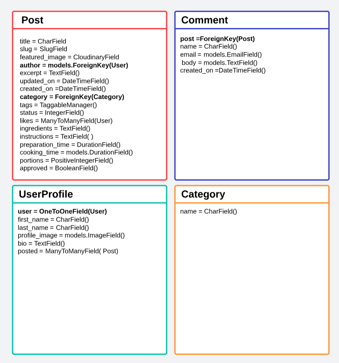

### Color Schema
The color scheme chosen for this recipe blog is thoughtfully designed to evoke a sense of simplicity and warmth, creating a visually appealing and comfortable environment for users. 
The vibrant orange adds a pop of energy, stimulating creativity and appetite. It draws attention to important elements without being overpowering.

### Typography
 The font family chosen for the project is 'Noto Serif'. The backup font, in case the 'Noto Serif' font is unavailable, is a generic serif font. 

[Back to top](<#table-of-contents>)

## Features
  * ## Template Features
    ## 1. Navigation Bar
    The template includes a responsive navigation bar with the following elements:
    - **Logo:** A TastyTales logo with a link to the home page.
    - **Navigation Links:** Home, About, Category, New Post, and Profile (with dropdown for authenticated users). Login and Sign Up links are also included for non-authenticated users.
    - **Search Bar:** A search bar with a search button, allowing users to search for recipes.
    

<b> Navbar Non-user Image</b>

    
    
    
 
    

<b>Navbar User Image</b>

    
    
 
    

<b>Navbar User Dropdown Image</b>

    
    
    
 
   
    ## 2. Message Alerts
    The template displays message alerts to users for various CRUD operations or other system messages. Messages include icons for success, info, warning, or error, along with a close button. Includes a JavaScript script that automatically removes message alerts after a timeout of 4 seconds, providing a clean user experience.

    ## 3. Footer
    The footer is divided into several sections:
    - **Brand Information:** Includes the TastyTales logo, a brief description, and a call-to-action for users to sign up.
    - **Common Tags:** Displays a list of common tags, each clickable and leading to posts with the respective tag.
    - **Quick Links:** Links to About, Category, New Post, Your Drafts, and user profile pages (if authenticated).
    - **Connect with Us:** Social media links (Google, Instagram, LinkedIn, GitHub) for users to connect with the platform.
    - **Footer Bottom:** Displays copyright information and states that all rights are reserved to TastyTales.
    
    

<b>Footer Image</b>

    
    
 
    

<b>Footer Non-users Image</b>

    
    
 

    ## 4. Main Page 

    This template extends the base.html template, indicating that it inherits its structure and styles.
  - Hero Section
    - Displays a welcoming message with the title "Welcome to TastyTales" for non-authenticated users.
    - Showcases the essence of TastyTales, inviting users to join the culinary adventure.
  - Blog List Column
    - Displays a large title "The Latest & Greatest."
    - Iterates over a list of blog posts (`post_list`) and displays each post in a card format.
    - If a featured image is present, it is displayed. Otherwise, a default image is used.
    - Author: Displays the author's name with a link to their profile.
    - Date: Displays the publication date of the post.
    - Title: Displays the post title with a link to the detailed post view.
    - Excerpt: Displays a brief excerpt from the post content.
    - Tags: Displays post tags as clickable badges, leading to tagged posts.
    - Likes: Displays the number of likes for the post.
    - Provides a link to continue reading the full post.
    - If pagination is enabled (is_paginated), standard pagination links are displayed to navigate between pages.
    - "Previous" and "Next" buttons are provided when applicable.

    

<b>Main Page Image</b>

    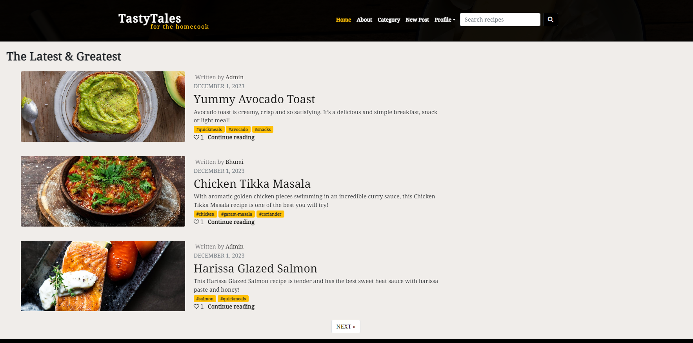
    
 

    ## 5. Post Creation Page

    This template is designed for editing and creating blog posts. It includes features to guide users through the editing process.

    - Utilizes Crispy Forms to render the form with enhanced styling.
    - The content within the block is displayed only if the user is authenticated (logged in).
    - Includes a background image container for an aesthetically pleasing interface.
    - Provides instructions and information about editing the post and explains that the post remains private until published.
    - Detailed instructions on using the Rich Text Editor (Desktop View), including:
      - Headers: Selecting different heading levels.
      - Images: Adding or uploading images.
      - Font Styles: Applying bold, italic, or underline.
      - Lists: Creating ordered or unordered lists.
      - Undo/Redo: Reverting or reapplying changes.
    - Offers a form for creating or editing a post.
    - Includes a title, body, and an option to upload a featured image.
    - "Save Draft" button: Allows saving the post as a draft.
    - "Publish" button: Publishes the post.
    
    

<b>Add Post Image</b>

    
    
 

    ## 6.Post Editing Page

    This template is designed for editing an existing blog post. It includes features to display an alert for post approval and a form for editing a post.
    ![ Image]

    -  Provides a background image container for an enhanced visual experience.
    - Checks if the post has been successfully submitted.
      - If `posted` is `True`, displays an alert indicating that the post is awaiting approval.
      - If `posted` is `False`, displays the post editing form.
    - An alert box with a success style indicating that the post is awaiting approval.
    - The main column for the post editing form.
    - Stylish container for the form.
    - Heading for the post editing section.
    -  Uses Crispy Forms to render the form with enhanced styling.
    - A button for submitting the updated post.
    

<b>Post Awaiting Approval Image</b>

    
    
 
    

<b>Edit Draft Image</b>

    
    
 

    ## 7. Post Deletion Confirmation Page
    This template is designed for confirming the deletion of a blog post. It includes features for displaying a confirmation message and providing options to either delete the post or cancel the action.

    - Creates a background image container with flex properties, aligning and justifying content in the center.
    - Sets up a column layout with padding for the confirmation form.
    - Stylish container for the confirmation form with white text and a centered layout.
    - Heading indicating that the user is confirming the deletion.
    - Message displaying the title of the post to be deleted with a red text color.
    - Flex container for aligning buttons evenly.
      - Button for confirming and submitting the deletion.
      - Button for canceling the deletion and redirecting to the home page.

    

<b>Delete Post Image</b>

    
    
 

    ## 8. Draft List Page

    This template is designed to display a user's drafts. It includes features for showing a list of drafts and providing a message when there are no drafts available.

    - Creates a container for content.
    - Sets up a row within the container.
    - Defines a column layout with a margin of 4 units on all sides.
    - Displays a heading indicating that the content below pertains to the user's drafts.
    -  Checks if there are drafts available for the user.
      - Starts an unordered list to display the drafts.
        -  Iterates through the drafts.
          - Displays each draft as a clickable link with the draft title.
    - Handles the case when there are no drafts.
      - Displays a message encouraging the user to turn their draft ideas into posts.
        - Button for creating a new post.
    
    

<b>Draft List Image</b>

    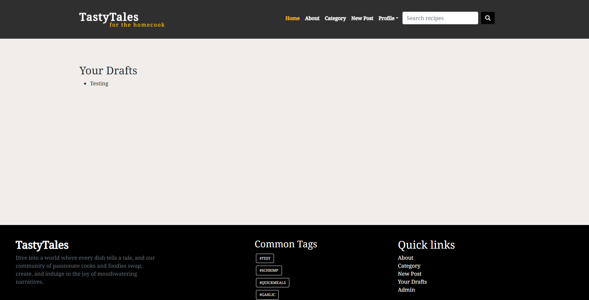
    
 

    ## 9. Draft Editing Template Features

    This template is designed for editing and managing a draft. It provides features for editing draft content, deleting drafts, and saving or publishing drafts.

    - Sets up a background image container for the draft editing section.
    - Displays a heading indicating that the content below pertains to editing a draft.
      - Includes form media for better rendering.
      - Renders the form using the crispy form library.
    - Positions buttons in a flex container with even spacing.
      - Button for deleting the draft.
      - Button for saving the draft.
      - Button for publishing the draft.
    
    

<b>Draft List Image</b>

    
    
 
    

<b>Draft List Empty Image</b>

    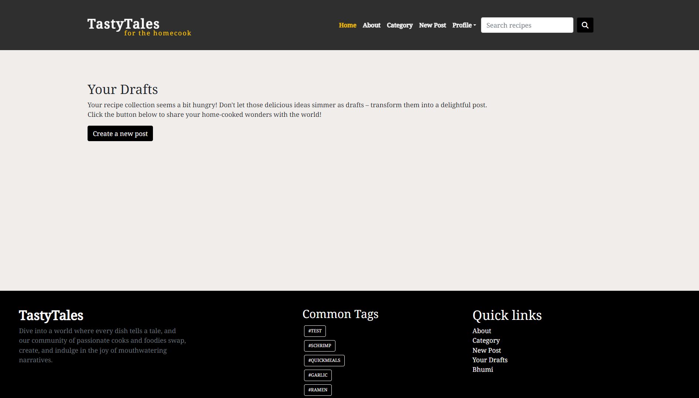
    
 

    ## 10. Post Detail Page

    This template is designed for displaying the details of a blog post, including the post content, author information, comments section, and related actions.

    - Container for:
      - Post title and author information.
      - Post meta information (prep time, cook time, yield).
      - Number of likes and comments.
      - Buttons for editing and deleting the post (if the user is authenticated).
    - Section for displaying the featured image.
      - Conditional check for a placeholder image or the actual featured image.
    - Section for displaying post tags.
      - Iterates over post tags and displays them as badges.
    - Container for the main post content.
      - Ingredients and instructions are displayed.
      - Like button with the ability to like or unlike the post.
    - Section for displaying the author's profile image, name, bio, and a link to find more.
      - Includes a default image if the author doesn't have a profile image.
    - Section for displaying comments.
      - Iterates over comments and displays name, creation date, and comment body.
      - Edit and delete buttons for comments if the user is authenticated.
    - Section for leaving a comment.
      - Form for posting comments, including the user's username if authenticated.
      - Shows a login prompt if the user is not authenticated.
    - Modal for confirming the deletion of a comment.

    

<b> Masthead Image</b>

    
    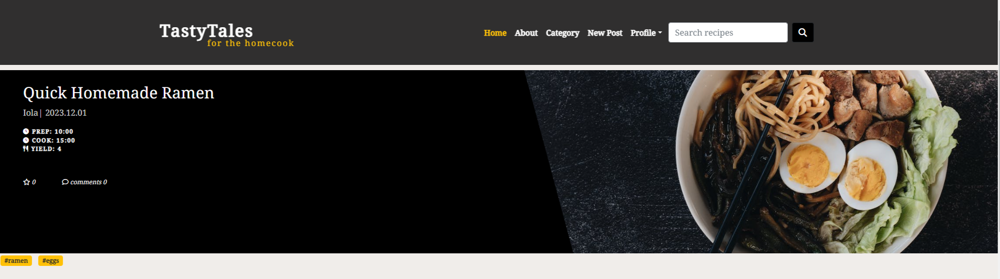
    
 
    

<b>Post Detail Image</b>

    
    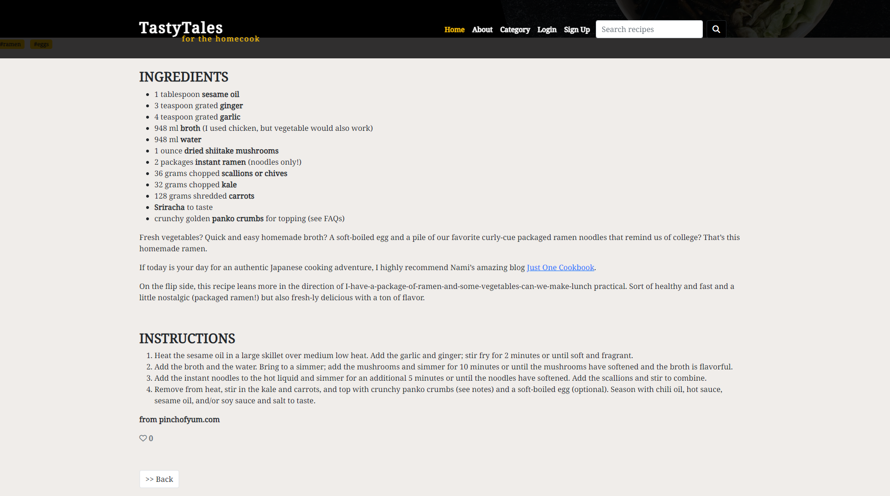
    
 
    

<b>Comment Section Image</b>

    
    
    
 

    ## 11. Category List Page

    This template is designed for displaying a list of existing categories, allowing users to add new categories if they are authenticated. If the user is not authenticated, a prompt to sign up is displayed.

    - Checks if the user is authenticated.
      - If authenticated, a form to create a new category is displayed.
      - If not authenticated, a prompt to sign up is displayed.
    - Create Category Form (Authenticated Users)
      - Form to create a new category.
      - "Add Category" button to submit the form.
    - Sign-Up Prompt (Unauthenticated Users)
      - "Sign Up" button to redirect to the sign-up page.
    - Row for displaying existing categories.
      - Column for the list of categories.
        - Heading for existing categories.
        - Iterates over existing categories (`categories`) and displays each category.
          - Each category is displayed in a column with a link to view posts in that category.
    - Link to navigate back to the home page.

    
    

<b>Category Add List Image</b>

    
    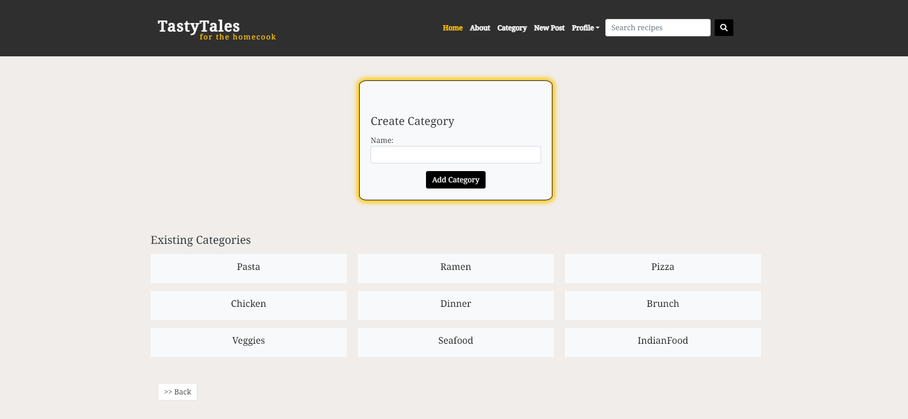
    
 
    

<b>Category List SignUp Image</b>

    
    
    
 

    ## 12. Category Posts Page

    This template is designed for displaying a list of posts within a specific category. It includes content to show posts when available and a message when there are no posts in the category.

    - Heading displaying the name of the category.
    - Iterates over posts in the category.
        - Styling for the post card.
          - Displays post information, including title, image, number of likes, excerpt, tags, and a link to the post detail page.
          - Heart icon with the number of likes.
          - Tags displayed as badges.

    - Content to display when there are no posts in the category.
      - Message displayed in a card with a prompt to create a post in the category.
      - "Create a Post" button to redirect to the add post page.

    - Link to navigate back to the category list.
    

<b>Category Post Image</b>

    
    
    
 
    

<b>Category Empty Post Image</b>

    
    
    
 

    ## 13. About Me Page

    This template is designed for displaying information about the author and the purpose of the website. It includes sections about the author, the purpose of the website, and a call-to-action for signing up.

    - Heading for the "About Me" section.
    - Providing a personal introduction and description of the website's purpose.
    - Providing information about the purpose of the website, the benefits of creating an account, and how to search for recipes.
    - Invitation message.
      - Call-to-action button linking to the account signup page.

    

<b>About Image</b>

    
    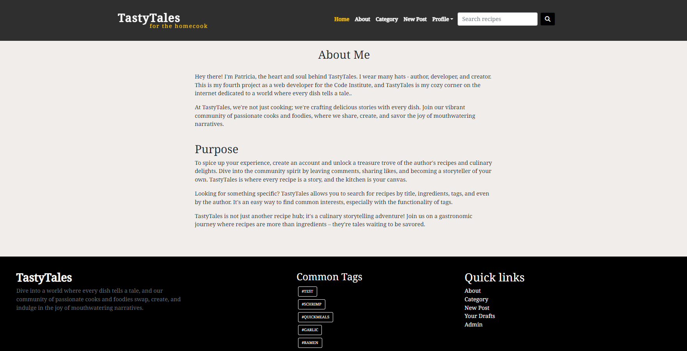
    
 

    ## 14. Search Results Page

    This template is designed to display search results for recipes. It includes sections for displaying searched posts, handling cases where no results are found, and suggesting common tags for exploration.

    - Searched Posts Section
      - Conditional check for whether a search query exists.
      - Heading displaying the search query.

      - Conditional check for whether there are search results.
      -  Loop through each search result.
          - Post Card:
            - Displaying post information, including title, featured image, likes, excerpt, and tags.

      - If no search results are found.
        - Display a message indicating no search results.
        - Display common tags section.

    - If no search query is provided.
      -  Display a message indicating no search query.
      -  Display common tags section.
    

<b>Search Page Image</b>

    
    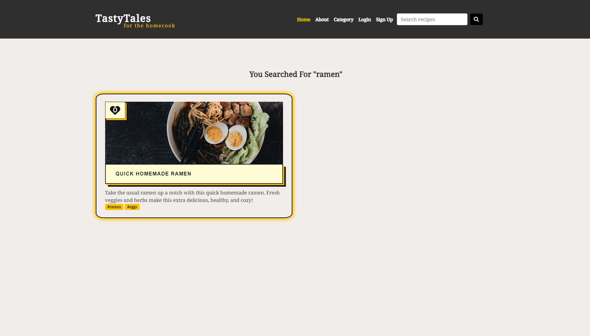
    
 
    

<b>No Search Results Page Image</b>

    
     
    
 

    ## 15. Posts by Tag Page

    This template is designed to display a list of posts associated with a specific tag. It includes sections for displaying the most common tags and a grid of posts related to the selected tag.

    - Comment indicating the start of the most common tags section.
    - Heading for the most common tags section.
      - Loop through common tags.
        -  Display each common tag as a badge.

    - Row for displaying posts by tag.
      - Loop through each post related to the tag.
        - Post Card:
          - Displaying post information, including title, featured image, likes, excerpt, and tags.
              - Display featured image.
              - If no featured image is available, display a default image.
                - Default image.

            - Heart icon for likes.
              - Display the number of likes.
            -  Post title with a link to the post detail page.
            - Post excerpt.
            - Display post tags.
    

<b>Post Tag Page Image</b>

    
    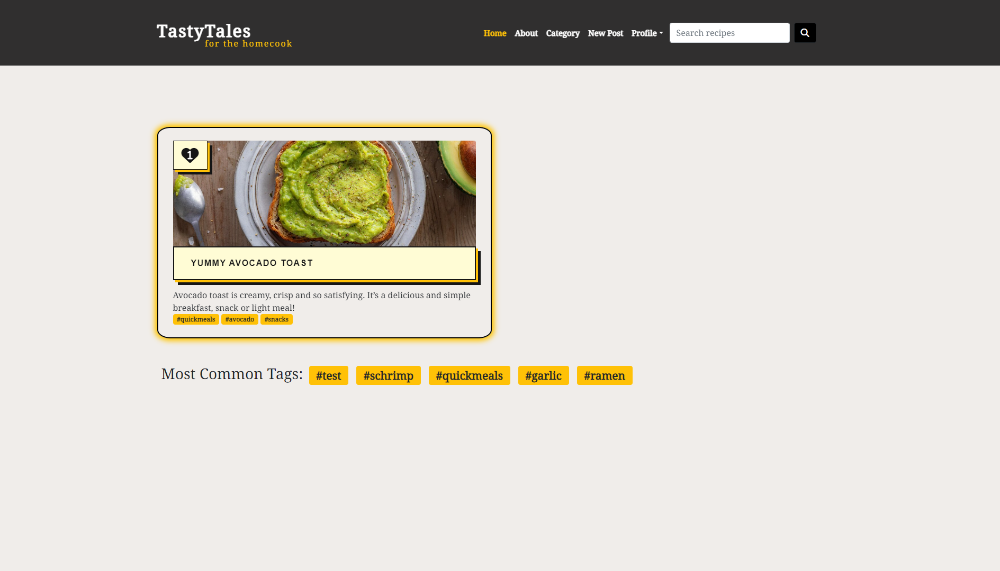
    
 

    ## 16. SignUp, SignIn and SignOut Page
    

<b>SignUp Image</b>

    
    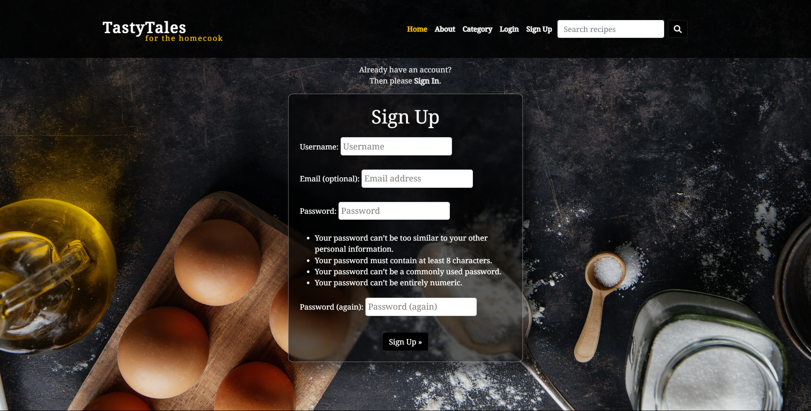
    
 
    

<b>SignIn Image</b>

    
    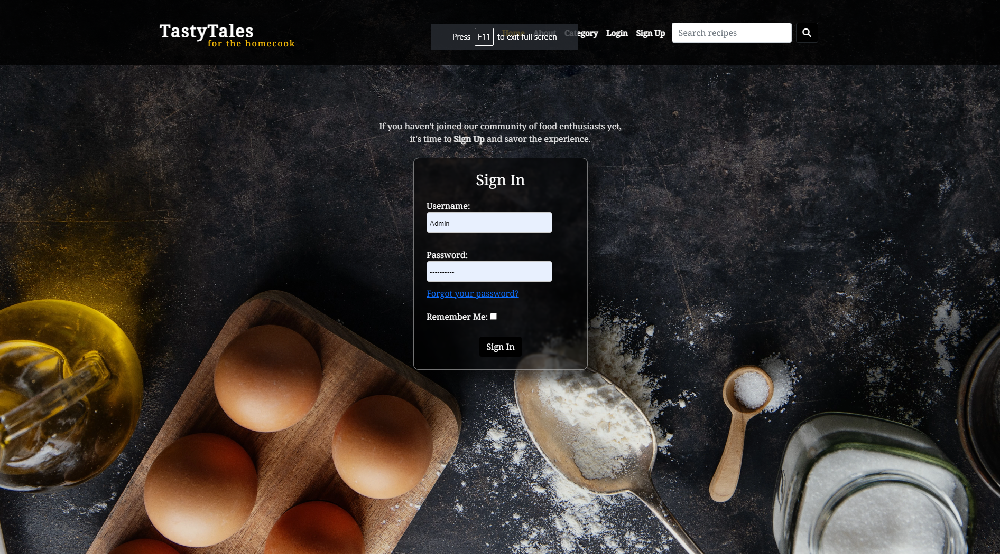
    
 
    

<b>SignOut Image</b>

    
    
    
 
      
    ## 17. 404 Page

    This template is designed to display a 404 page indicating that the requested page is unavailable. It includes a 404 heading, a message, and a search bar for users to navigate or search for content.

      - Large "404" heading.
      - Subheading indicating that the page is unavailable.
      - Message indicating that the requested page does not exist.

    - For additional information.
      - Subheading suggesting that the user can't find the desired content.
        - Paragraph providing additional guidance.
          - "Looks like nothing was found at this location. Maybe try one of the links below, click on the top menu, or try a search?"
    - Comment indicating the start of the search bar section.
      - Form for the search bar. Input field for searching recipes.
          - Search button with a magnifying glass icon.

    

<b>Image</b>

    
    
    
 

    [Back to top](<#table-of-contents>)

  * ## Future Features
    - Enable users to print recipes.
    - Integrate a button option for selecting measurements in grams or ounces for precise ingredient quantities.
    - Incorporate the capability to dynamically adjust recipe quantities based on desired portions, with interactive "+" and "-"
    - Enable recipe sharing functionality to enhance community engagement.
    - Implement a favorites system, allowing users to save and revisit their preferred recipes.

# Testing  

* ## Validator Testing
 - [W3C MarkUp Validation](https://validator.w3.org/)
 - [W3C CSS Validation](https://jigsaw.w3.org/css-validator/)
 - [CI Python Linter](https://pep8ci.herokuapp.com)
 - [JSHint](https://jshint.com/)

* ## Manual Testing
A separate document for testing can be viewed here: [TESTING.md](docs/TESTING.md)
        
* ## Browser Testing
- The website has had manual and responsive tests conducted on the below browsers. Ensuring functions are working as expected throughout browsers.

| Browser     | Layout      | Functionality |
| :---------: | :----------:| :-----------: |
| Chrome      | ✔          | ✔             |
| Firefox     | ✔          | ✔             |
| Safari      | ✔          | ✔             |

* ## Functionality
- Testing the complete functionality of the page. This includes:

[Back to top](<#table-of-contents>)

# Bugs

## Fixed bugs
### 1. "RelatedObjectDoesNotExist" Error
- I encounter the "RelatedObjectDoesNotExist" error at /members/edit_profile/ stating, "User has no profile," I was trying to access a related UserProfile object for a User that does not exist. I ensure using the signals method to create a profile upon user registration. Additionally, the `MembersConfig` class in the apps.py file in the members app, ensures that signals, including user profile creation signals, are appropriately registered during the Django application setup.

### 2. Tags in Footer not Displaying
- Tags declared in the footer base.html were not displaying as I entended using same methods for other templates as tags_page.html, post_detail.html and search_results.html, so I've created a context processors file to declare the tags logic and in the views.py file (blog app), import and include this processor to enable the global display of tags in all templates within the app.

### 3. Tags Input Field Displaying Signs and Brackets
- To address the issue of the tags input field displaying signs and brackets, I fix this by adding the `TagWidget` in the NewPost form. This modification to the TagWidget class ensures that when rendering the widget, it will display a comma-separated string of tags, ensuring a clean and user-friendly appearance.

### 4. Profile Image Upload Issue
- I encountered issues with the profile image being unable to upload. To enable image uploads for the `profile_image` field in the UserProfile model, I updated it to use the `ImageField` and installed the Pillow library. 

### 5. Display of Users Draft Posts in Search Results and Profile
- An issue I identified wherein draft posts were erroneously appearing in the search results and the profile page. To prevent this behavior, drafts are now excluded from the search results in the class view when a user conducts a search and in the Profile class view.

### 6. ProgrammingError at /admin/blog/post/
- An issue occurred when attempting to change the `category` field to a ForeignKey from the Post model to establish a relationship with the Category Model.  After running command `python manage.py migrate` did not successfully create the category_id field as expected. I reset the migrations `python3 manage.py migrate your_app_name zero` in this case, to get a fresh start on these. This action effectively clears the existing migration files and the database schema.

### 7. Most Common Tags Not Displaying Updated Information
- The common tags feature, the tags were not displaying the most recent and common ones. I realized that after resetting the database schema and creating new posts with updated tags, the old most common tags continued to be displayed. The issue stemmed from the context processor that was fetching the first four tags without considering the number of associated posts. To resolve this, I modified the context processor to use the same logic applied in the SearchResults view. The context processor now annotates the tags with the count of associated posts and orders them accordingly, ensuring that only the top four most common tags are retrieved.

## Media Query - Responsive Web Design
-

## Unfixed bugs
- Unique Title Constraint: Editing a post in draft mode cannot be saved due to the unique title constraint. Removing the constraint alters slug-related issues.
- ck Editor Form Image Upload Responsiveness: Uploading images in the form without setting a radio button for image selection results in unresponsiveness across the screen, particularly on small devices.

[Back to top](<#table-of-contents>)

## Deployment

### Running the project by using Gitpod:
1. Go to the [project repository](https://github.com/patthoege/tasty-tales-blog-pp4)
2. Click the green button that says "Gitpod" and the project will now open up in Gitpod.

### Deploying with Heroku

I followed the below steps using the Code Institute tutorial:

The following command in the Gitpod CLI will create the relevant files needed for Heroku to install your project dependencies `pip3 freeze --local > requirements.txt`. Please note this file should be added to a .gitignore file to prevent the file from being committed.

1. Go to [Heroku.com](https://dashboard.heroku.com/apps) and log in; if you do not already have an account then you will need to create one.
2. Click the `New` dropdown and select `Create New App`.
3. Enter a name for your new project, all Heroku apps need to have a unique name, you will be prompted if you need to change it.
4. Select the region you are working in.

#### Heroku Settings  
You will need to set your Environment Variables - this is a key step to ensuring your application is deployed properly.
1. In the Settings tab, click on `Reveal Config Vars` and set the following variables:
    - Add key: `PORT` & value `8000`
    - Add key: DATABASE_URL, this should have been created automatically by Heroku.
    - Add key: CLOUDINARY_URL and the value as your cloudinary API Environment variable e.g.
    - Add key: SECRET_KEY and the value as a complex string which will be used to provide cryptographic signing.

2. Buildpacks are also required for proper deployment, simply click `Add buildpack` and search for the ones that you require.
    - For this project, I needed to add `Python`.

####  Heroku Deployment  
In the Deploy tab:
1. Connect your Heroku account to your Github Repository following these steps:
    - Click on the `Deploy` tab and choose `Github-Connect to Github`.
    - Enter the GitHub repository name and click on `Search`.
    - Choose the correct repository for your application and click on `Connect`.
2. You can then choose to deploy the project manually or automatically, automatic deployment will generate a new application every time you push a change to Github, whereas manual deployment requires you to push the `Deploy Branch` button whenever you want a change made.
3. Once you have chosen your deployment method and have clicked `Deploy Branch` your application will be built and you should now see the `View` button, click this to open your application.

[Back to top](<#table-of-contents>)

## Installation

To run TastyTales on the local machine, I follow these steps:

### Run the repository
- Go to the [project repository](https://github.com/patthoege/tasty-tales-blog-pp4)
- Click the green button that says "Gitpod" and the project will now open up in Gitpod.

### Install dependencies
- `pip install -r requirements.txt`

### Apply database migrations
- `python manage.py migrate`

### Create a superuser account
- `python manage.py createsuperuser`

### Start the development server
- `python manage.py runserver`

[Back to top](<#table-of-contents>)

# Technologies Used
### Languages
* HTML5
* CSS3
* Python
* JavaScript

### Frameworks, Libraries, Programs
- Python Built-in Modules:
  - [os](https://docs.python.org/3/library/os.html) 

- External Packages
  - [cloudinary](https://pypi.org/project/cloudinary/1.29.0/) 
  - [dj-database-url](https://pypi.org/project/dj-database-url/0.5.0/) 
  - [dj3-cloudinary-storage](https://pypi.org/project/dj3-cloudinary-storage/0.0.6/) 
  - [Django](https://pypi.org/project/Django/3.2.14/) 
  - [django-allauth](https://pypi.org/project/django-allauth/0.51.0/)
  - [gunicorn](https://pypi.org/project/gunicorn/20.1.0/)
  - [psycopg2](https://pypi.org/project/psycopg2/2.9.3/) 
  - [Pillow](https://pypi.org/project/Pillow/)
  - [Django CKEditor](https://django-ckeditor.readthedocs.io/en/latest/)
  - [Django Summernote](https://pypi.org/project/django-summernote/)
  - [Django Crispy Forms](https://django-crispy-forms.readthedocs.io/en/1.14.0/)

### Programs & Tools

- [Google Fonts:](https://fonts.google.com/)
  - Was used to to incorporate font styles.  
- [Bootstrap](https://getbootstrap.com/)
  - Was used to create the front-end design.
- [Animate.css](https://animate.style/)
  - Was used to create animation to the project.
- [GitPod:](https://gitpod.io/)
  - Gitpod was used as IDE to commit and push the project to GitHub.
- [GitHub:](https://github.com/)
  - Was used for all storing and backup of the code pertaining to the project.
- [Balsamiq:](https://balsamiq.com/)
  - Was used to create wireframes
- [LucidCharts:](https://www.lucidchart.com/)
  - Was used to create the database schema.
- [Favicon:](https://favicon.io/favicon-generator/ )
  - Was used to create the favicon logo.
- [Looka:](https://looka.com/editor/157809201)
  - Was used to create the logo image for the project.
- [Freepik:](https://www.freepik.com/)
  - Was used to search images for the project. 
- [Colorlib:](https://colorlib.com/wp/template/bootstrap-footer-14/)
  - Was used to find inspiration footer layout.
- [CloudConvert:](https://cloudconvert.com/png-to-webp )
  - Was used to convert WEBP images formats for the project. 
 
[Back to top](<#table-of-contents>)

# Credits
### Content
- I have used these resources to add content to this project:
  - [pinchofyum](https://pinchofyum.com/)
  - [damndelicious](https://damndelicious.net/) 
  - [chat.openai](https://chat.openai.com/) 

[Back to top](<#table-of-contents>)

### Frameworks and Code
- [Code Institute's](https://codeinstitute.net/) - Walkthrough Project "I Think Therefore I Blog"

- [Developer Timeline](https://www.youtube.com/watch?v=pnFCdWQbryo) - Tutorial to retrieve the class tagged.

- [StackOverflow](https://stackoverflow.com/questions/1895638/django-tagging-count-and-ordering-top-tags-is-there-a-cleaner-solution-to-m) and [docs.djangoproject](https://docs.djangoproject.com/en/dev/topics/db/aggregation/#filter-and-exclude) - counting common number of tags.

- [Codemy.com](https://www.youtube.com/watch?v=AGtae4L5BbI) - Tutorial to retrieve search term.

- [geeksforgeeks](https://www.geeksforgeeks.org/django-creating-a-404-error-page/) - add the path to the 404.html file.

- [dev](https://dev.to/ieeecsvitc/integrating-rich-text-editor-with-django-k19) - Integrating Rich Text Editor with Django.

- [Codemy.com](https://www.youtube.com/watch?v=_ph8GF84fX4) - How to create choices for the category.

- [Codemy.com](https://www.youtube.com/watch?v=6-XXvUENY_8&list=PLxED07G8CYrqly5rRO93Xi5HNo8kRT6GO&index=1) - How to use widgets with class form control.

- [StackOverflow](https://stackoverflow.com/questions/64957025/how-to-display-just-the-tags-in-form-instead-of-all-the-list-elements-in-django) - How to fix tags input in the form field.

- [StackOverflow](https://stackoverflow.com/questions/2223429/django-global-template-variables) and [dev](https://dev.to/sarahhudaib/context-processors-in-django-15h2) - Django context processors available globally to templates.

- [StackOverflow](https://stackoverflow.com/questions/36317816/relatedobjectdoesnotexist-user-has-no-userprofile), [StackOverflow](https://stackoverflow.com/questions/61580144/django-create-profile-for-user-signal) and [Pyplane](https://www.youtube.com/watch?v=W8MLlwvSS-U&t=1078s) -  to connect Profile database to User.

- [Codepen](https://codepen.io/flvffywvffy/pen/rNoeymB) - button effect inspiration.

- [StackOverflow](https://stackoverflow.com/) and [Django Documentation](https://docs.djangoproject.com/en/4.2/) were consulted during the whole project for various issues I faced, both from front end and back end.

[Back to top](<#table-of-contents>)

# Acknowledgments
- I extend my sincere gratitude to my Mentor [Martina Terlevic](https://github.com/SephTheOverwitch) for her invaluable support and insightful feedback during the development of this project. Her guidance played a crucial role in shaping the final outcome and has been greatly appreciated.
- The tutors from Code Institute that helped me overcome the issues that I faced with the project.

Patricia Höge 2023.

[Back to top](<#table-of-contents>)
